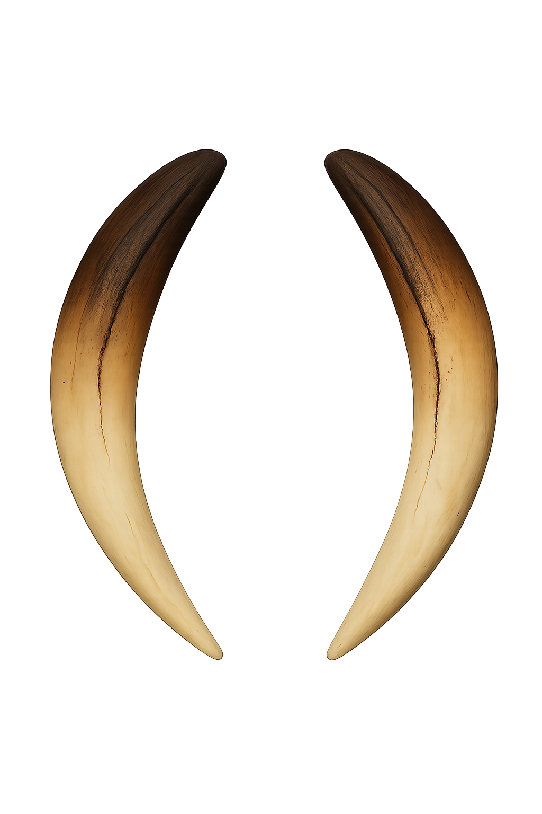

# Blended Website Design - Blue Theme + Steve Dylan Minimalism

Check out this site for more inspiration:
https://calaveras.ai/


## Overview
Blend the current blue-themed design with Steve Dylan's clean, minimalist, mobile-responsive approach.

## 1. Color Scheme & Typography

### Colors (Keeping Blue Theme)
```css
:root {
  --bg-primary: #0000fe;
  --text-primary: #ffffff;
  --text-secondary: rgba(255, 255, 255, 0.9);
  --border: rgba(255, 255, 255, 0.2);
  --link: #ffffff;
  --link-hover: rgba(255, 255, 255, 0.7);
  --box-bg: #ffffff;
  --box-text: #0000fe;
}
```

### Typography
```css
body {
  font-family: -apple-system, BlinkMacSystemFont, 'Segoe UI', Roboto,
               'Helvetica Neue', Arial, sans-serif;
  font-size: 16px;
  line-height: 1.6;
  color: var(--text-primary);
  background: var(--bg-primary);
}

h1 { font-size: 2rem; font-weight: 700; }
h2 { font-size: 1.5rem; font-weight: 600; }
h3 { font-size: 1.25rem; font-weight: 600; }

/* Mobile Typography */
@media (max-width: 768px) {
  body { font-size: 14px; }
  h1 { font-size: 1.75rem; }
  h2 { font-size: 1.25rem; }
}
```

## 2. HTML Structure

### Complete Page Structure
```html
<!DOCTYPE html>
<html lang="en">
<head>
  <meta charset="UTF-8">
  <meta name="viewport" content="width=device-width, initial-scale=1.0">
  <title>Smilodon Software</title>
  <style>
    /* CSS goes here */
  </style>
</head>
<body>
  <!-- Skip to content for accessibility -->
  <a href="#main" class="sr-only">Skip to content</a>

  <!-- Header with Navigation -->
  <header>
    <div class="container">
      <nav class="nav-wrapper">
        <a href="/" class="logo">
          
          <span>Smilodon Software</span>
        </a>

        <!-- Desktop Navigation -->
        <div class="nav-links desktop-only">
          <a href="/">Home</a>
          <a href="#about">About</a>
          <a href="#blog">Blog</a>
          <a href="#connect">Connect</a>
        </div>

        <!-- Mobile Menu Button -->
        <button class="mobile-menu-btn mobile-only" aria-label="Menu">
          <svg width="24" height="24" viewBox="0 0 24 24" fill="none" stroke="currentColor">
            <path d="M3 12h18M3 6h18M3 18h18" stroke-width="2" stroke-linecap="round"/>
          </svg>
        </button>
      </nav>

      <!-- Mobile Navigation Drawer -->
      <div class="mobile-nav" id="mobile-nav">
        <a href="/">Home</a>
        <a href="#about">About</a>
        <a href="#blog">Blog</a>
        <a href="#connect">Connect</a>
      </div>
    </div>
  </header>

  <!-- Main Content -->
  <main id="main" class="container">
    <!-- Hero Section -->
    <section class="hero">
      <h1 class="hero-title">Smilodon Software</h1>
      <p class="subtitle">Software & AI Engineering</p>

      <!-- Logo Image -->
      <div class="hero-logo">
        
      </div>
    </section>

    <!-- Connect Section (moved up like you requested) -->
    <section id="connect" class="section">
      <h2 class="section-title">Connect</h2>
      <div class="contact-info">
        <a href="mailto:admin@smilodonsoftware.co">admin@smilodonsoftware.co</a>
      </div>
    </section>

    <!-- About Section -->
    <section id="about" class="section">
      <h2 class="section-title">About</h2>
      <div class="content">
        <p>Building AI orchestration tools for small companies.
           Helping clients get the most out of their tokens.
           Writing some thoughts on technology and AI.</p>
        <p>Preference for open-source and in-house tooling.</p>
        <p>Writing code in the following languages:</p>
        <ul class="tech-list">
          <li>Rust</li>
          <li>Go</li>
          <li>Python</li>
          <li>TypeScript</li>
        </ul>
        <p>Everyone needs inference - let us show you how to do it.</p>
      </div>
    </section>

    <!-- Blog Section -->
    <section id="blog" class="section">
      <h2 class="section-title">Blog</h2>
      <ul class="post-list">
        <li class="post-item">
          <time datetime="2025-01-22">22 Jan 2025</time>
          <a href="#" class="post-link">Blog posts coming soon...</a>
        </li>
      </ul>
    </section>
  </main>

  <!-- Footer -->
  <footer>
    <div class="container">
      <div class="footer-content">
        <div class="copyright">© 2025 Smilodon Software</div>
        <nav class="footer-nav">
          <a href="/">Home</a>
          <a href="#blog">Blog</a>
          <a href="#about">About</a>
        </nav>
      </div>
    </div>
  </footer>

  <script>
    // Mobile menu toggle
    document.addEventListener('DOMContentLoaded', function() {
      const menuBtn = document.querySelector('.mobile-menu-btn');
      const mobileNav = document.querySelector('.mobile-nav');

      if (menuBtn) {
        menuBtn.addEventListener('click', function() {
          mobileNav.classList.toggle('active');
        });
      }
    });
  </script>
</body>
</html>
```

## 3. Responsive CSS Styles

### Base Styles
```css
* {
  margin: 0;
  padding: 0;
  box-sizing: border-box;
}

body {
  font-family: -apple-system, BlinkMacSystemFont, 'Segoe UI', Roboto,
               'Helvetica Neue', Arial, sans-serif;
  background: #0000fe;
  color: #ffffff;
  line-height: 1.6;
  min-height: 100vh;
  display: flex;
  flex-direction: column;
}

.container {
  max-width: 960px;
  margin: 0 auto;
  padding: 0 20px;
}

/* Accessibility */
.sr-only {
  position: absolute;
  width: 1px;
  height: 1px;
  padding: 0;
  margin: -1px;
  overflow: hidden;
  clip: rect(0,0,0,0);
  white-space: nowrap;
  border-width: 0;
}
```

### Navigation Styles
```css
header {
  background: #0000fe;
  border-bottom: 1px solid rgba(255, 255, 255, 0.2);
  position: sticky;
  top: 0;
  z-index: 100;
  padding: 1rem 0;
}

.nav-wrapper {
  display: flex;
  justify-content: space-between;
  align-items: center;
}

.logo {
  display: flex;
  align-items: center;
  gap: 0.75rem;
  text-decoration: none;
  color: #ffffff;
  font-weight: 600;
  font-size: 1.25rem;
}

.logo-icon {
  width: 30px;
  height: 30px;
}

/* Desktop Navigation */
.nav-links {
  display: flex;
  gap: 2rem;
}

.nav-links a {
  color: #ffffff;
  text-decoration: none;
  padding: 0.5rem 0;
  border-bottom: 2px solid transparent;
  transition: all 0.2s;
}

.nav-links a:hover {
  opacity: 0.7;
  border-bottom-color: #ffffff;
}

/* Mobile Navigation */
.mobile-menu-btn {
  display: none;
  background: none;
  border: 1px solid rgba(255, 255, 255, 0.3);
  border-radius: 4px;
  padding: 0.5rem;
  cursor: pointer;
  color: #ffffff;
  transition: all 0.2s;
}

.mobile-menu-btn:hover {
  background: rgba(255, 255, 255, 0.1);
}

.mobile-nav {
  display: none;
  position: absolute;
  top: 100%;
  left: 0;
  right: 0;
  background: #0000fe;
  border-bottom: 1px solid rgba(255, 255, 255, 0.2);
  padding: 1rem 0;
}

.mobile-nav.active {
  display: block;
}

.mobile-nav a {
  display: block;
  padding: 0.75rem 1rem;
  color: #ffffff;
  text-decoration: none;
  border-bottom: 1px solid rgba(255, 255, 255, 0.1);
}

.mobile-nav a:hover {
  background: rgba(255, 255, 255, 0.1);
}

/* Responsive Utilities */
@media (max-width: 768px) {
  .desktop-only { display: none !important; }
  .mobile-menu-btn { display: block !important; }
}

@media (min-width: 769px) {
  .mobile-only { display: none !important; }
  .mobile-nav { display: none !important; }
}
```

### Hero Section
```css
.hero {
  padding: 4rem 0;
  text-align: left;
}

.hero-title {
  font-size: 2rem;
  font-weight: bold;
  text-transform: uppercase;
  letter-spacing: 4px;
  background: white;
  color: #0000fe;
  padding: 15px 30px;
  display: inline-block;
  border: 2px solid white;
  margin-bottom: 2rem;
}

.subtitle {
  font-size: 1.25rem;
  opacity: 0.9;
  margin-bottom: 2rem;
}

.hero-logo {
  margin: 3rem 0;
}

.logo-main {
  width: 300px;
  height: 300px;
  max-width: 100%;
  height: auto;
}

@media (min-width: 768px) {
  .hero {
    text-align: center;
  }

  .logo-main {
    width: 400px;
    height: 400px;
  }
}
```

### Content Sections
```css
.section {
  margin: 2rem 0;
  padding: 2rem 0;
  border-top: 1px solid rgba(255, 255, 255, 0.2);
}

.section-title {
  font-size: 1.5rem;
  text-transform: uppercase;
  letter-spacing: 2px;
  margin-bottom: 1.5rem;
  padding-bottom: 0.5rem;
  border-bottom: 2px solid rgba(255, 255, 255, 0.3);
  display: inline-block;
}

.content {
  opacity: 0.9;
}

.content p {
  margin-bottom: 1rem;
  line-height: 1.8;
}

/* Tech List */
.tech-list {
  list-style: none;
  padding: 0;
  margin: 1rem 0;
}

.tech-list li {
  padding: 0.25rem 0;
  padding-left: 1.5rem;
  position: relative;
}

.tech-list li::before {
  content: "▸";
  position: absolute;
  left: 0;
}

/* Contact Info */
.contact-info a {
  color: #ffffff;
  text-decoration: underline;
  font-size: 1.1rem;
}

.contact-info a:hover {
  opacity: 0.7;
}

/* Blog Posts */
.post-list {
  list-style: none;
  padding: 0;
}

.post-item {
  display: flex;
  gap: 2rem;
  margin-bottom: 1rem;
  padding: 0.5rem 0;
  flex-direction: column;
}

.post-item time {
  opacity: 0.7;
  min-width: 120px;
  font-size: 0.9rem;
}

.post-link {
  color: #ffffff;
  text-decoration: underline;
}

.post-link:hover {
  opacity: 0.7;
}

@media (min-width: 640px) {
  .post-item {
    flex-direction: row;
    align-items: baseline;
  }
}
```

### Footer
```css
footer {
  margin-top: auto;
  padding: 3rem 0 2rem;
  border-top: 1px solid rgba(255, 255, 255, 0.2);
}

.footer-content {
  display: flex;
  flex-direction: column;
  gap: 1rem;
  align-items: center;
  text-align: center;
  opacity: 0.8;
}

.footer-nav {
  display: flex;
  gap: 2rem;
}

.footer-nav a {
  color: #ffffff;
  text-decoration: none;
  padding: 0.25rem;
}

.footer-nav a:hover {
  text-decoration: underline;
}

@media (min-width: 640px) {
  .footer-content {
    flex-direction: row;
    justify-content: space-between;
    text-align: left;
  }
}
```

## 4. Mobile-Specific Optimizations

### Touch Targets & Responsive Images
```css
/* Minimum touch target size */
a, button {
  min-height: 44px;
  display: inline-flex;
  align-items: center;
}

/* Responsive Images */
img {
  max-width: 100%;
  height: auto;
}

/* Mobile-specific adjustments */
@media (max-width: 768px) {
  .section {
    margin: 1.5rem 0;
    padding: 1.5rem 0;
  }

  .hero {
    padding: 2rem 0;
  }

  .hero-title {
    font-size: 1.5rem;
    letter-spacing: 2px;
    padding: 10px 20px;
  }

  .logo-main {
    width: 200px;
    height: 200px;
  }
}
```

## 5. Key Design Decisions

### What We Keep from Current Design:
- Blue background (#0000fe)
- White text throughout
- White boxed title style
- Your existing logo/branding

### What We Adopt from Steve Dylan:
- Clean, semantic HTML structure
- Mobile-responsive navigation
- Left-aligned content (center on desktop for hero)
- Minimalist approach (no animations)
- Date/time stamps for blog posts
- Simple underlined links
- Responsive breakpoints

## 6. Implementation Checklist

- [ ] Replace current HTML with semantic structure
- [ ] Add viewport meta tag
- [ ] Implement responsive navigation
- [ ] Update CSS to mobile-first approach
- [ ] Test on multiple screen sizes
- [ ] Ensure touch targets are 44px minimum
- [ ] Add mobile menu JavaScript
- [ ] Test with real devices
- [ ] Optimize images for different sizes
- [ ] Verify accessibility features

## 7. JavaScript for Mobile Menu

```javascript
document.addEventListener('DOMContentLoaded', function() {
  const menuBtn = document.querySelector('.mobile-menu-btn');
  const mobileNav = document.querySelector('.mobile-nav');

  if (menuBtn) {
    menuBtn.addEventListener('click', function() {
      mobileNav.classList.toggle('active');
      menuBtn.setAttribute('aria-expanded',
        mobileNav.classList.contains('active'));
    });
  }

  // Close menu when clicking links
  const mobileLinks = document.querySelectorAll('.mobile-nav a');
  mobileLinks.forEach(link => {
    link.addEventListener('click', () => {
      mobileNav.classList.remove('active');
    });
  });

  // Close menu when clicking outside
  document.addEventListener('click', (e) => {
    if (!menuBtn.contains(e.target) && !mobileNav.contains(e.target)) {
      mobileNav.classList.remove('active');
    }
  });
});
```

## 8. Comparison Table

| Feature | Current Design | New Blended Design |
|---------|---------------|-------------------|
| Background | Blue (#0000fe) | Blue (#0000fe) ✓ |
| Text Color | White | White ✓ |
| Layout | Center-aligned | Left-aligned (mobile), Mixed (desktop) |
| Navigation | None | Clean header with mobile menu |
| Logo Size | 600px fixed | 200-400px responsive |
| Animations | Yes | None (minimal transitions only) |
| Mobile Support | Limited | Full responsive design |
| Typography | Courier | Modern sans-serif |
| Sections | Center blocks | Left-aligned with borders |

This design maintains your distinctive blue aesthetic while implementing modern, mobile-responsive best practices inspired by Steve Dylan's minimalist approach.

## 9. Brutalist Design Integration (from Mockup 10/11)

### Philosophy
Blend Swedish brutalism (architectural typography, heavy weights, structure) with Japanese minimalism (ma/negative space, restraint) while maintaining the blue theme.

### Typography Hierarchy
```css
/* Massive brutalist titles */
h1 {
    font-size: 5.5rem;
    font-weight: 900;
    letter-spacing: -3px;
    line-height: 0.85;
    text-transform: uppercase;
}

/* Navigation/secondary headers */
h2, .nav-link {
    font-size: 1.75rem;
    font-weight: 700;
    letter-spacing: 1px;
    text-transform: uppercase;
}

/* Terminal/system labels */
.system-label {
    font-family: 'Courier New', monospace;
    font-size: 0.625rem;
    color: #55ffff; /* cyan */
    letter-spacing: 3px;
    text-transform: uppercase;
}
```

### Color Palette Extensions
```css
:root {
    --primary-blue: #0000fe;
    --dos-cyan: #55ffff;      /* Terminal accents, hover states */
    --dos-yellow: #ffff55;    /* Alternative hover state */
    --dos-white: #ffffff;
    --dos-black: #000000;     /* Shadows, depth */
}
```

### Navigation Interaction Pattern
```css
/* Terminal-style hover with instant transition */
nav a {
    transition: none; /* No smooth animations */
}

nav a:hover {
    color: var(--dos-cyan); /* or --dos-yellow */
}

nav a:hover::before {
    content: "> "; /* Terminal arrow prefix */
}
```

### Layout Constraints
```css
/* Narrower viewport for brutalist composition */
.container {
    max-width: 1300px;
}

/* Asymmetric two-column grid */
.splash {
    display: grid;
    grid-template-columns: 1fr 1fr;
    padding: 6rem 5rem;
    gap: 4rem;
}
```

### Key Principles
- **No smooth animations**: All interactions instant (`transition: none`)
- **Extreme contrast**: 0.625rem labels → 5.5rem titles → 1.75rem nav
- **Asymmetric composition**: Type wall (left) vs silent icon (right)
- **Single focal point**: One massive element dominates
- **Terminal aesthetics**: Monospace labels, arrow prefixes, system-style text

### Mobile Adaptations
```css
@media (max-width: 768px) {
    h1 {
        font-size: 2.5rem; /* Scale down but maintain weight */
        letter-spacing: -1px;
    }

    .system-label {
        font-size: 0.5rem;
    }

    .splash {
        grid-template-columns: 1fr; /* Stack on mobile */
        padding: 3rem 2rem;
    }
}
```

### What NOT to Do
- ❌ Smooth transitions/animations
- ❌ Multiple competing focal points
- ❌ Medium-sized everything (weak hierarchy)
- ❌ Triple redundancy (same content repeated)
- ❌ Symmetrical compositions
- ❌ Purposeless negative space

## 10. Design Philosophy Comparison: calaveras.ai Analysis

### Overview
Calaveras.ai demonstrates **quiet brutalist minimalism** - enterprise confidence through restraint rather than bold statements.

### Their Approach

**Visual Design:**
- **Color**: Pure grayscale (white, #f5f5f5, soft grays) - no color accents
- **Typography**: IBM Plex Mono monospace throughout (100% commitment)
- **Layout**: Balanced, symmetrical two-column responsive design
- **Visual Interest**: "Binding" element with radial gradient for subtle texture
- **Whitespace**: Generous margins and spacing as primary design tool
- **Philosophy**: Functionality and clarity over ornamentation

**Key Design Decisions:**
```css
/* Their approach */
font-family: 'IBM Plex Mono', monospace;
background: #ffffff;
color: #333333; /* or similar gray */
layout: symmetrical, balanced;
accents: none (grayscale only);
hierarchy: subtle, uniform sizing;
```

### Comparison: Quiet vs Loud Brutalism

| Aspect | Calaveras.ai (Quiet) | Smilodon Brutalist (Loud) |
|--------|---------------------|---------------------------|
| **Color Palette** | Grayscale only | Vibrant blue + cyan/yellow |
| **Typography** | Consistent monospace | Extreme contrast (900 weight titles) |
| **Font Sizing** | Subtle hierarchy | Massive range (0.625rem → 5.5rem) |
| **Layout** | Balanced two-column | Asymmetric (type wall vs icon) |
| **Visual Interest** | Radial gradient binding | DOS terminal aesthetics |
| **Brand Voice** | "Serious enterprise AI" | "Indie software with personality" |
| **Philosophy** | Confidence through restraint | Confidence through boldness |
| **Interaction** | Minimal, direct | Terminal arrows, instant feedback |

### What to Learn from calaveras.ai

**✓ Adopt:**
1. **Aggressive whitespace usage** - Let content breathe even more
2. **Structural elements** - Consider a "binding" or frame element for visual interest without clutter
3. **Monospace commitment** - Consider using monospace more consistently within sections
4. **Responsive philosophy** - Maintain design principles across all breakpoints

**✓ Keep from our approach:**
1. **Blue identity** - Distinctive and memorable vs corporate grayscale
2. **Cyan/yellow accents** - Personality and warmth that pure grayscale lacks
3. **Extreme typography contrast** - Makes a bold statement
4. **Asymmetric composition** - More dynamic and engaging
5. **Terminal aesthetics** - Interactive personality (arrows, system labels)

### Hybrid Experiment Idea

What if we blended both approaches?

```css
/* "Brutalist DOS meets Enterprise Minimalism" */
background: #0000fe; /* Keep blue identity */
color: #ffffff;
font-family: 'IBM Plex Mono', monospace; /* Consistent monospace like calaveras */
font-size: 5.5rem; /* Keep massive titles */
accents: white only; /* Remove cyan/yellow, use white like calaveras */
layout: asymmetric; /* Keep dynamic composition */
terminal-arrows: keep; /* Maintain interactive feedback */
```

**Result**: Retro computing aesthetic with enterprise restraint.

### Design Direction Decision Matrix

Choose based on brand positioning:

| If you want to be seen as... | Choose... |
|------------------------------|-----------|
| Enterprise AI consultancy | Quiet brutalism (calaveras style) |
| Indie software boutique | Loud brutalism (current DOS style) |
| Technical expertise + personality | Hybrid (blue + monospace + restraint) |
| Maximum differentiation | Loud brutalism with color |

## 11. Simplified Splash Page Concept

### Ultra-Minimal Single CTA Approach

**Philosophy**: Remove all navigation, focus user on single action.

### Content Structure

```
SMILODON

We are software and AI engineering experts.
We help our customers turn tokens into code.

[Schedule a Call]
```

**That's it.** No nav, no sections, no blog links. Pure conversion focus.

### Design Variations

#### Option A: Loud Brutalist Minimal
```css
.splash-minimal {
    background: #0000fe;
    min-height: 100vh;
    display: flex;
    flex-direction: column;
    align-items: center;
    justify-content: center;
    text-align: center;
    padding: 2rem;
}

.title {
    font-size: 5.5rem;
    font-weight: 900;
    letter-spacing: -3px;
    color: #ffffff;
    text-transform: uppercase;
    margin-bottom: 3rem;
}

.value-prop {
    font-size: 1.5rem;
    font-weight: 400;
    line-height: 1.8;
    color: #ffffff;
    max-width: 600px;
    margin-bottom: 3rem;
}

.cta-button {
    font-size: 1.25rem;
    font-weight: 700;
    text-transform: uppercase;
    letter-spacing: 2px;
    background: #ffffff;
    color: #0000fe;
    padding: 1.5rem 3rem;
    border: 3px solid #ffffff;
    text-decoration: none;
    display: inline-block;
    transition: none;
}

.cta-button:hover {
    background: #55ffff; /* Cyan hover */
    color: #0000fe;
    border-color: #55ffff;
}
```

#### Option B: Quiet Brutalist Minimal (calaveras-inspired)
```css
.splash-minimal {
    background: #ffffff;
    min-height: 100vh;
    display: flex;
    flex-direction: column;
    align-items: center;
    justify-content: center;
    text-align: center;
    padding: 2rem;
}

.title {
    font-family: 'IBM Plex Mono', monospace;
    font-size: 3rem;
    font-weight: 600;
    color: #000000;
    text-transform: uppercase;
    margin-bottom: 3rem;
}

.value-prop {
    font-family: 'IBM Plex Mono', monospace;
    font-size: 1.2rem;
    line-height: 1.8;
    color: #333333;
    max-width: 600px;
    margin-bottom: 3rem;
}

.cta-button {
    font-family: 'IBM Plex Mono', monospace;
    font-size: 1rem;
    text-transform: uppercase;
    letter-spacing: 1px;
    background: #000000;
    color: #ffffff;
    padding: 1rem 2rem;
    border: 2px solid #000000;
    text-decoration: none;
    display: inline-block;
}

.cta-button:hover {
    background: #ffffff;
    color: #000000;
}
```

#### Option C: Hybrid (Blue + Monospace Restraint)
```css
.splash-minimal {
    background: #0000fe;
    min-height: 100vh;
    display: flex;
    flex-direction: column;
    align-items: center;
    justify-content: center;
    text-align: center;
    padding: 2rem;
}

.title {
    font-family: 'Space Grotesk', sans-serif;
    font-size: 4rem;
    font-weight: 900;
    color: #ffffff;
    text-transform: uppercase;
    letter-spacing: -2px;
    margin-bottom: 3rem;
}

.value-prop {
    font-family: 'IBM Plex Mono', monospace;
    font-size: 1.2rem;
    line-height: 1.8;
    color: rgba(255, 255, 255, 0.9);
    max-width: 600px;
    margin-bottom: 3rem;
}

.cta-button {
    font-family: 'Space Grotesk', sans-serif;
    font-size: 1.125rem;
    font-weight: 700;
    text-transform: uppercase;
    letter-spacing: 1px;
    background: #ffffff;
    color: #0000fe;
    padding: 1.25rem 2.5rem;
    border: 2px solid #ffffff;
    text-decoration: none;
    display: inline-block;
    transition: none;
}

.cta-button:hover::before {
    content: "> "; /* Terminal arrow */
}
```

### HTML Structure
```html
<!DOCTYPE html>
<html lang="en">
<head>
    <meta charset="UTF-8">
    <meta name="viewport" content="width=device-width, initial-scale=1.0">
    <title>Smilodon Software - AI Engineering Experts</title>
    <link rel="preconnect" href="https://fonts.googleapis.com">
    <link href="https://fonts.googleapis.com/css2?family=Space+Grotesk:wght@400;700;900&display=swap" rel="stylesheet">
    <link rel="stylesheet" href="assets/css/style.css">
</head>
<body>
    <main class="splash-minimal">
        <h1 class="title">Smilodon</h1>

        <p class="value-prop">
            We are software and AI engineering experts.<br>
            We help our customers turn tokens into code.
        </p>

        <a href="https://calendly.com/your-link" class="cta-button">
            Schedule a Call
        </a>
    </main>
</body>
</html>
```

### Mobile Optimization
```css
@media (max-width: 768px) {
    .title {
        font-size: 2.5rem;
        letter-spacing: -1px;
    }

    .value-prop {
        font-size: 1rem;
        padding: 0 1rem;
    }

    .cta-button {
        font-size: 1rem;
        padding: 1rem 2rem;
    }
}
```

### Considerations for Single-CTA Approach

**Pros:**
- ✅ Maximum conversion focus
- ✅ Zero cognitive load
- ✅ Fast load time (minimal HTML/CSS)
- ✅ Clear value proposition
- ✅ Mobile-perfect

**Cons:**
- ❌ No SEO content (single page)
- ❌ No blog/about context
- ❌ Users can't explore offerings
- ❌ May seem too aggressive for cold traffic

**Solution**: Multi-page option
- Landing page: Minimal single CTA
- Secondary pages: /about, /blog, /services accessible via footer link or post-calendly
- Use landing page for paid ads, full site for organic traffic

### Recommended Copy Variants

**Option 1 (Current):**
> We are software and AI engineering experts.
> We help our customers turn tokens into code.

**Option 2 (Shorter):**
> AI engineering experts.
> Turn tokens into code.

**Option 3 (Benefit-focused):**
> We help small companies build custom AI tools.
> No bloat. Just code.

**Option 4 (Technical):**
> Software and AI engineering consultancy.
> Rust • Go • Python • TypeScript

**Option 5 (Ultra-minimal):**
> Software engineering.
> AI orchestration.
> [Schedule a Call]
